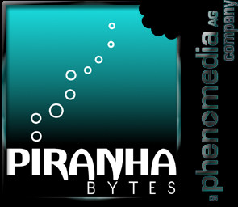
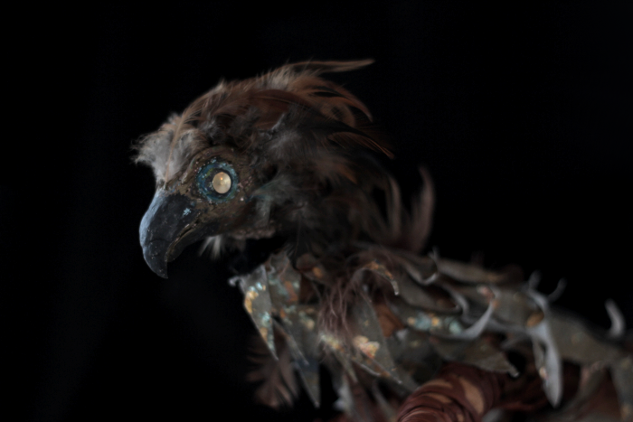
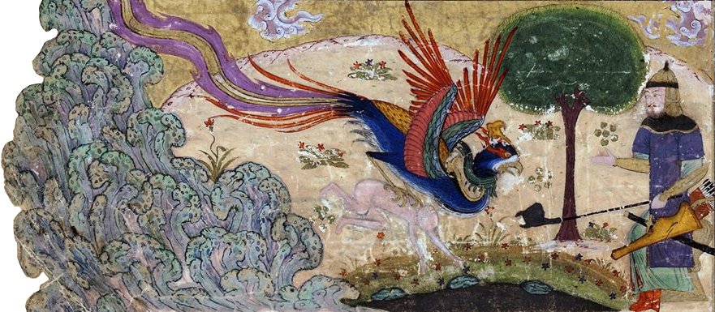
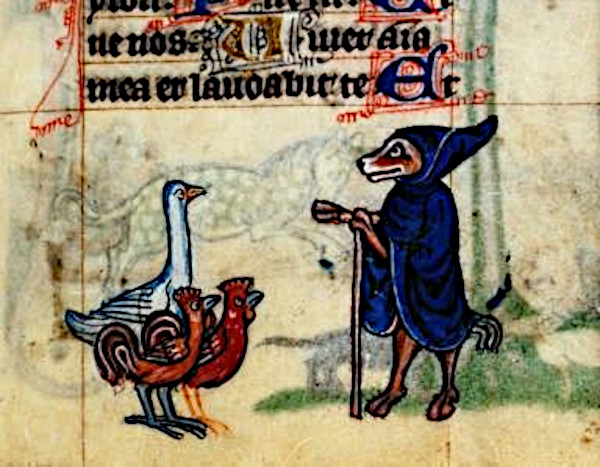
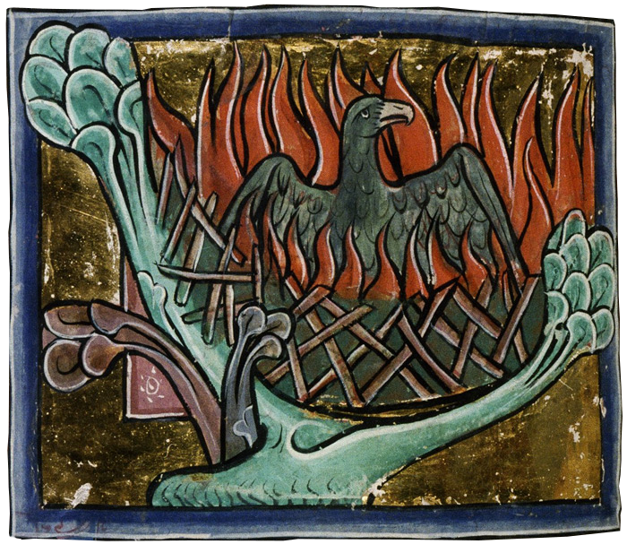
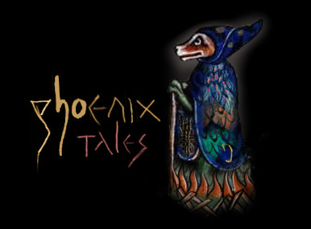
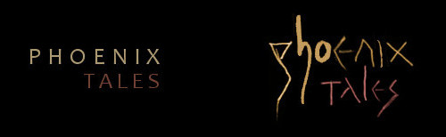
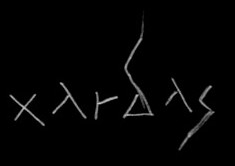

# Making of PhoenixTales

2021-02-18 by flosha  

For some time I wanted to write something about how I made the logo of our team, mostly because I wanted to show the beautiful medieval artworks, that I found in the course of its creation (some of them I used, some I didn't), before they get lost in the depths of my drives. But before I do so, I probably should describe how we founded Phoenix Tales and where the name came from.  

I recall that I came up with the idea to found a team, but rejected it myself at first, since for me it didn't seem to make much sense to found a team with just two people (logx and me at the time). But logx, liking the idea, basically said: "two people are a team already, aren't they?" I should have known that, two are enough in acrobatics after all.  

In order to found a team, we were in need of a name. We agreed that the name should be inspired by Piranha Bytes. But I also wanted to take inspiration from the Mad Scientists.  

We both thought that we should include Phoenix into it, but it was logx who came up with 'Phoenix Tales'. For those of you for which the reference and double meaning is not obvious, let me explain:  

Just as Piranha Bytes consists of two terms: a creature (Piranha) and the ambiguous Bytes, readable as Bites, so is Phoenix Tales consisting of two terms: a (mythical) creature (Phoenix) and the ambiguous Tales, readable as 'Tails'. At the same time it reminds of Project Phoenix, the working title of GOTHIC, which we chose later as the title of our game, while 'tales' tries to emphasize our design focus: To tell immersive and meaningful stories, that, ideally, someday would have the status of famous tales.  

At first I was not sure about the title. It was lacking the aspect of madness that I wanted to borrow from the Mad Scientists. I guess I thought about it for about two days. But I couldn't come up with a better name and logx convinced me with its ambiguity. I gave my approval and we had a name.  

Immediately I started to design a logo.  

I knew that I wanted to have our name written next to a phoenix. And the first thing that came to my mind was a bird that was modeled according to an idea of mine, a stop motion film that I wanted to create at some time. It was about two main protagonists: a bird and a girl.  

 

I took an old picture of the bird from the side and created this draft. I didn't think it was too bad. It looked like a phoenix and it had something to it; at least it was mystical enough:  

I liked it, but was not fully convinced. logx wasn't impressed, thereby blunting my enthusiasm for the logo (although I think I never told him about the stop motion film and that this bird represented a character).  

Right from the beginning I thought it shouldn't be a regular phoenix, it should be dark and mystic and with some blue colour in it, not just fiery all over. The original model above met some of those requirements. But I had something different in mind.  

I thought that it shouldn't be too serious, it should be a mad, little, wise, mystic, yoda-like phoenix. I imagined the artworks of pro-skaters in the early era of skateboarding, you know, the power-peralta classics like 'The Mutt', the famous pro deck of <a href="https://www.youtube.com/watch?v=NgJrSUqKUEE">Rodney Mullen</a>.  
  
The madness I couldn't have in our name, I wanted to make up for in the logo. But how to do this? In my opinion, there was no need to make it from scratch. Just as our work in <a href="https://phoenixthegame.com">Project Nyx</a> often resembles a sort of patchwork, creating a beautiful mosaic out of broken little pieces.  

And which style could be more fitting for this purpose than real medieval artworks, that are - most of them - royalty free as a bonus? I started to look for phoenixes and general paintings of birds in medieval books.  

This are some of the best works I found. Here the phoenix appears to collect its own firewood to burn himself:  

The same as here, from the Morgan Library in New York:  

I like this one especially, for the contrast of the fire with the beautiful blue background. The colours were chosen well:  

Oh, I also found this pretty peafowl!  

<!---
Here the phoenix is presented as a sacrifice on an altar:

-->

I also looked for artworks of the Simurgh, more or less the oriental equivalent of the Phoenix as described in the Manṭeq al-ṭayr ('Conference of the Birds') by the famous medieval sufi Farīd al-Dīn ʿAṭṭār.  

I like how the sun is drawn here, conveying the idea that the fire is coming from the sun and rising back to its source:  

And no idea what is going on on this artwork, but I get the impression that the poor blue bird in a coat adorned by little moons, is sacrificing himself for his children...  

But all those pictures I didn't use at the end. Because I found this guy by accident, an auspicious fox in a blue coat, preaching to two cocks and a goose, with a stick and a beautiful hood.  

I decided to work with this as a base. Then I took the head, the firewood and the flames from this artwork here, as you may recognize:  

I used a bit of the beautiful blue fur of this wolf:  

Putting all of this together I came up with this (here the peak of the phoenix above was not yet included):  

Do you recognize how similar the eye of the fox and the eye of the phoenix above is? But their eyes were too small and had not much expression. I wanted to have an eye that was drawn by me, at least the eye. Regarding expression I think, that the eye was the most important. So I took it from a sketch that I had made a few years before of Jochanan (aka John) the Babtist, as he was displayed at some church:  

On our logo, the yearning and pain that is shown in this sketch I could not really convey. Could be due to the entirely different head positioning. Maybe I will try to improve this.  

The script of course, changed too. I thought: Just as we make our game from hand, we shouldn't use some random computer font, I should <em>write</em> it. The phoenix tales script first looked like this (as you see I sticked to the colours that I used from the start, more or less):  

And this style of the signs here I had from my "Xardas the puppeteer" sketch, that you can see on <a href="https://phoenixthegame.com">phoenixthegame.com</a>, under which I had written 'Xardas' in this style. The p of Phoenix was originally Xardas' "d":  

This little idea of how to write those signs evolved into a style of its own that I developed further for the 20th anniversary, when I wrote the title and subtitle for <a href="https://phoenixthegame.com/specials/20thAnniversaryEssay.html">my essay, that we'll publish at march 15th</a>.  

You may have seen that the h and the o do not seem to fit to the rest. It is the opposite of perfect and clean. But I decided against "fixing" it.  
The logo basically is still as it was in the beginning. I made it and there it was and for some reason I thought it would be bad to "perfect" it. I wanted to keep this roughness of it and its patchwork-style. There is no perfection in the medieval books either. Because they were made by hand on paper. If you make a failure, you cannot fix it easily. Thus I kept it.  

The colour of the script (and of the phoenix) changed over time to the less saturated version below. You know, just like the fading colour of clothing, which is an essential aspect of the wabi-sabi artstyle of our game. Then, at some day, I played around with filters in GIMP. What happened to the logo was an accident, but I found it quite beautiful and so I took it as a "water" variant. We call it logo-water or logo-blood depending on the colour (in our header you see both when hovering over the logo):  

No perfection, just attempt. But beauty lies in the attempt.  
It fits to the graffiti we placed inside the world of our game and unto various promotion artworks, while the medieval artworks shown above will inspire ingame-illustrations of books that we want to include (we're still looking for an artist to do this for us).  

As you see, the making of the logo went a long way in the development of our style as a whole and with our presentation in general. The bird itself evolved over the years. I always changed another little detail. You know the current end result:  

Update: At the 15th anniversary of STALKER I came up with a new STALKER variant of our phoenix, which the Phoenix ASCII art on our team page is based on (see [phoenixtales.de](https://phoenixtales.de)):  

 
**Read next:**
* [Behind the ASCII Art](/Appendix/behind-the-scenes/ascii)